# Run Agents GitHub Authentication Recovery (REMOTE-2616)

## Summary
When an accepted `run_agents` action dispatches remote children that require GitHub authentication, the action must stay alive and recover rather than prematurely failing. Today, `StartAgentExecutor` maps `ConversationStatus::Blocked` to a terminal initialization failure, which causes `RunAgentsExecutor` to mark the child as failed and complete the entire batch. This specification introduces a client-only recovery architecture centered on a distinct nonterminal `AIActionStatus::BlockedOnUserAction` variant maintained in `running_actions`. The system streams typed blocker updates, projects a single actionable remediation state over mixed or all-blocked batches, presents a unified card with aggregate counts and one process-wide GitHub OAuth call-to-action (CTA), pauses and re-arms per-attempt spawn timeouts, coordinates retry through monotonic completion generations, and isolates parent cancellation so already-launched siblings continue running undisturbed.

## Product behavior

1. **Post-Confirmation Remediation State**: When one or more remote children in an accepted `run_agents` action encounter a recoverable GitHub authentication blocker during launch, the action card replaces its in-flight spawning indicator with a runtime auth remediation view. All pre-confirmation configuration controls (model picker, harness picker, environment picker, runner picker, execution mode toggle, and the Accept split button) are permanently omitted from this view to match existing post-confirmation cloud-agent UI.
2. **Immediate Any-Blocker Projection**: The batch projects `AIActionStatus::BlockedOnUserAction` immediately when any child enters a recoverable auth-blocked state. This applies to all-blocked batches and partial batches alike—even if other siblings are actively launching, already launched, retrying, or permanently failed.
3. **Unified Grouped Status Counts**: Rather than rendering repetitive per-child authentication cards or forms, the remediation view groups child statuses into high-level summary counters:
   - Launched count (for example: "2 child agents launched")
   - Auth-blocked count (for example: "1 child agent awaiting GitHub authorization")
   - In-flight spawning or retrying count (for example: "1 child agent starting...")
4. **Single Process-Wide Call-to-Action**: Because GitHub OAuth completion in the user's browser authenticates the user process-wide across all repositories and environments, the card displays a single primary CTA button labeled "Connect GitHub" (or "Authenticate with GitHub"). Clicking the CTA opens the normalized authorization URL in the user's default browser.
5. **Distinct Permanent Failure Rows**: If any child encounters an unrecoverable failure (such as an invalid configuration, missing harness binary, capacity limit, or credit exhaustion), the card displays an individual failure row showing the child's display name and specific error message. These rows remain visible alongside the grouped counts and the auth CTA, allowing the user to remediate auth-blocked siblings while remaining informed of permanent failures.
6. **Automatic Batch Resumption on OAuth Callback**: When the browser redirects back to Warp and triggers `GitHubAuthNotifier::AuthCompleted`, all eligible auth-blocked children immediately transition to retrying. The card returns to the standard spawning view ("Spawning agents...") while automated launch attempts resume. The action returns to `AIActionStatus::RunningAsync` once no auth blocker remains.
7. **Per-Attempt Timeout with Human Pause**: Each automated launch attempt is bounded by a 30-second timeout (`SPAWN_TIMEOUT`). While a child is in the auth-blocked state waiting for human interaction, the timeout timer is paused. Upon receiving OAuth completion, a fresh 30-second timeout re-arms for the subsequent attempt.
8. **Preservation of Terminal Action Results**: When all children reach terminal outcomes, the action completes and records `RunAgentsResult::Launched` containing per-child `RunAgentsAgentOutcome` records. The original input order of child configurations is strictly preserved in the final result, regardless of concurrent resolution or retry timing.
9. **TUI Parity**: In the headless TUI (`crates/warp_tui`), the orchestration block renders an equivalent remediation block displaying the title, grouped counts, permanent failure reasons, and the clickable or copyable GitHub OAuth URL. Pre-execution key hints (`Enter to accept`, `Ctrl + E to edit`) are suppressed; only `Ctrl + C to cancel` is active.

## Technical design

### Current State and Problem
- **Pre-execution vs. Running**: `BlocklistAIActionModel` manages pending actions in `pending_actions: HashMap<AIConversationId, VecDeque<AIAgentAction>>` and running actions in `running_actions: HashMap<AIConversationId, RunningActions>` (`app/src/ai/blocklist/action_model.rs:225-230`).
- **Action Status Enum**: `AIActionStatus` (`app/src/ai/blocklist/action_model.rs:74-93`) currently defines five variants: `Preprocessing`, `Queued`, `Blocked`, `RunningAsync`, and `Finished(Arc<AIAgentActionResult>)`. `AIActionStatus::Blocked` is strictly a pre-execution status assigned when an action is at index 0 of `pending_actions` and awaits user confirmation or execution permission.
- **Child Dispatch & Premature Failure**:
  - `RunAgentsExecutor::dispatch_children_for_prepared_request` (`app/src/ai/blocklist/action_model/execute/run_agents.rs:222-284`) fans out child launches via `StartAgentExecutor::dispatch`.
  - `StartAgentExecutor::dispatch` (`app/src/ai/blocklist/action_model/execute/start_agent.rs:246-278`) returns an `async_channel::Receiver<StartAgentOutcome>`, where `StartAgentOutcome` is limited to `Started { agent_id }` or `Error(String)`.
  - When a remote child pane is created (`app/src/pane_group/pane/terminal_pane.rs:1876-1969`), `AmbientAgentViewModel::spawn_internal` spawns the cloud task. If the server returns a `ClientError` with `auth_url`, `AmbientAgentViewModel::handle_ambient_agent_stream_error` (`app/src/terminal/view/ambient_agent/model.rs:1300-1331`) classifies it via `classify_cloud_agent_startup_error` (`app/src/ai/orchestration/remote_child.rs:325-333`) as `CloudAgentStartupBlocker::GitHubAuthRequired`.
  - `AmbientAgentViewModel::handle_needs_github_auth` (`model.rs:1395-1436`) transitions the view model to `Status::NeedsGithubAuth` and emits `NeedsGithubAuth`.
  - `TerminalView::handle_ambient_agent_event` (`app/src/terminal/view/ambient_agent/view_impl.rs:300-315`) sets child conversation status to `ConversationStatus::Blocked { blocked_action: CHILD_AGENT_GITHUB_AUTH_REQUIRED_BLOCKED_ACTION }`.
  - `StartAgentExecutor::handle_history_event` receives `UpdatedConversationStatus` and invokes `start_agent_error_message_for_status` (`start_agent.rs:297-330`). Because `ConversationStatus::Blocked` is treated as an error, `complete_pending_as_error` sends `StartAgentOutcome::Error` to `RunAgentsExecutor`.
  - `RunAgentsExecutor` receives `Error`, maps the child slot to `RunAgentsAgentOutcomeKind::Failed`, and immediately finishes the entire batch, leaving `AmbientAgentViewModel` listening to `GitHubAuthNotifier` in a detached, abandoned state.

```mermaid
flowchart TD
  subgraph Current_Flow["Current Defective Flow"]
    A1[RunAgents Accepted] --> B1[StartAgentExecutor::dispatch]
    B1 --> C1[Server returns auth_url]
    C1 --> D1[Child ConversationStatus::Blocked]
    D1 --> E1[start_agent_error_message_for_status: Error]
    E1 --> F1[StartAgentOutcome::Error sent to RunAgentsExecutor]
    F1 --> G1[RunAgents completes with Failed child]
  end

  subgraph Proposed_Flow["Proposed Recovery Flow"]
    A2[RunAgents Accepted] --> B2[StartAgentExecutor::dispatch_with_updates]
    B2 --> C2[Server returns auth_url]
    C2 --> D2[Child ConversationStatus::Blocked]
    D2 --> E2[StartAgentUpdate::Blocked emitted; request retained]
    E2 --> F2[RunAgentsExecutor tracks ChildSlotState::AuthBlocked]
    F2 --> G2[Action projects AIActionStatus::BlockedOnUserAction]
    G2 --> H2[Card shows grouped CTA; 30s timer paused]
    H2 --> I2[User completes browser OAuth]
    I2 --> J2[GitHubAuthNotifier::AuthCompleted with generation N+1]
    J2 --> K2[RunAgentsExecutor re-arms 30s timer & triggers retry]
    K2 --> L2[Child launches -> RunAgentsResult::Launched]
  end
```



### Proposed Changes

#### 1. Core Action Model Status (`app/src/ai/blocklist/action_model.rs`)
- Add a new nonterminal variant to `AIActionStatus`:
  ```rust
  pub enum AIActionStatus {
      Preprocessing,
      Queued,
      Blocked,
      RunningAsync,
      /// The action is running asynchronously, but execution is paused awaiting
      /// an out-of-band user remediation action (such as GitHub OAuth authorization).
      BlockedOnUserAction,
      Finished(Arc<AIAgentActionResult>),
  }
  ```
- Add helper methods and preserve existing invariants:
  ```rust
  impl AIActionStatus {
      pub fn is_blocked(&self) -> bool {
          // Strictly pre-execution approval Blocked
          matches!(self, AIActionStatus::Blocked)
      }

      pub fn is_blocked_on_user_action(&self) -> bool {
          matches!(self, AIActionStatus::BlockedOnUserAction)
      }

      pub fn is_running(&self) -> bool {
          // True for all active in-flight executions, including auth waits
          matches!(self, AIActionStatus::RunningAsync | AIActionStatus::BlockedOnUserAction)
      }

      pub fn is_done(&self) -> bool {
          matches!(self, AIActionStatus::Finished(..))
      }
  }
  ```
- Update `get_action_status(&self, id: &AIAgentActionId) -> Option<AIActionStatus>`:
  - When `running_actions` contains `id`, query `RunAgentsExecutor::is_blocked_on_user_action(id)`.
  - If true, return `Some(AIActionStatus::BlockedOnUserAction)`.
  - Otherwise, return `Some(AIActionStatus::RunningAsync)`.
- Action Queue & Parent Status Invariant: The action remains in `self.running_actions` throughout the auth wait. It is never moved back to `self.pending_actions`. Parent `ConversationStatus` remains `InProgress` and is never transitioned to `ConversationStatus::Blocked`.

#### 2. Typed Start Agent Update Stream (`app/src/ai/blocklist/action_model/execute/start_agent.rs`)
- Define typed lifecycle updates to replace the one-shot outcome channel:
  ```rust
  #[derive(Clone, Debug)]
  pub enum StartAgentUpdate {
      /// Child startup encountered a recoverable blocker requiring user action.
      Blocked(CloudAgentStartupBlocker),
      /// The child is retrying startup following remediation.
      Retrying,
      /// The child successfully launched on the server.
      Started { agent_id: String },
      /// The child encountered an unrecoverable terminal error.
      Failed { error: String },
  }
  ```
- In `StartAgentExecutor`:
  - Retain `PendingStartAgent` entries across `Blocked` events.
  - In `maybe_complete_pending_for_child_state` and `handle_history_event`: when `ConversationStatus::Blocked` is received with `CHILD_AGENT_GITHUB_AUTH_REQUIRED_BLOCKED_ACTION`, resolve the associated `CloudAgentStartupBlocker::GitHubAuthRequired` (from child view model or error context), emit `StartAgentUpdate::Blocked(...)`, and leave the pending entry in `self.pending`.
  - Close the update stream and remove from `self.pending` only on terminal events (`Started`, `Failed`, or explicit parent cancellation).
  - Clean up child pane/conversation only on unrecoverable launch failure via `should_cleanup_failed_child_launch`, keeping auth-blocked child conversations intact.

#### 3. RunAgents Executor Concurrency, Generations, and Retries (`app/src/ai/blocklist/action_model/execute/run_agents.rs`)
- Per-child tracking structure:
  ```rust
  enum ChildSlotState {
      Spawning {
          attempt: usize,
          timer: Pin<Box<Timer>>,
      },
      AuthBlocked {
          blocker: CloudAgentStartupBlocker,
          blocked_generation: u64,
          attempt: usize,
      },
      Retrying {
          attempt: usize,
          timer: Pin<Box<Timer>>,
      },
      Launched {
          agent_id: String,
      },
      PermanentlyFailed {
          error: String,
      },
      Cancelled,
  }
  ```
- **Authoritative Progress Snapshot**:
  `RunAgentsExecutor` maintains the authoritative state of all child slots for each active `action_id`. It exposes:
  ```rust
  pub struct RunAgentsProgressSnapshot {
      pub launched_count: usize,
      pub auth_blocked_count: usize,
      pub in_flight_count: usize,
      pub failed_agents: Vec<(String, String)>, // (child_name, error_message)
      pub primary_auth_url: Option<String>,
  }
  ```
- **OAuth Generation Counter & Race Prevention**:
  - `RunAgentsExecutor` subscribes to `GitHubAuthNotifier::handle(ctx)`.
  - Maintain `current_oauth_generation: u64` (initialized to 0, incremented on each `GitHubAuthEvent::AuthCompleted`).
  - *Callback-before-blocker race*: When a child encounters an auth blocker, it records `blocked_generation = current_oauth_generation`. If an `AuthCompleted` event was already delivered while the blocker message was in flight, the child sees `blocked_generation < current_oauth_generation` and immediately transitions to `Retrying` without waiting for another human action.
  - *Duplicate callbacks*: If multiple `AuthCompleted` events fire for a single browser redirect, children only retry if `blocked_generation < event_generation`. Once retrying, further identical events are no-ops.
  - *Repeated blockers*: If a child retries and the server returns a second auth blocker (e.g. missing organization access), `attempt` increments and `blocked_generation` updates to the latest generation, waiting for the next explicit user auth cycle.
- **Per-Attempt Timeout Logic**:
  - `const SPAWN_TIMEOUT: Duration = Duration::from_secs(30);`
  - In `Spawning` or `Retrying`, an automated 30-second timer runs concurrently.
  - Upon transition to `AuthBlocked`, the timeout timer is cancelled/paused.
  - Upon transition to `Retrying`, a fresh 30-second timer is armed.
  - If the timer fires while in `Spawning` or `Retrying`, that child slot transitions to `PermanentlyFailed` with a timeout error message.
- **Parent Cancellation Handling**:
  - If the parent action or conversation is cancelled:
    - Set all non-terminal child slots to `Cancelled`.
    - Drop unresolved update stream receivers in `StartAgentExecutor`.
    - If a child cloud task was already assigned a `task_id` (or if `TaskSpawned` arrives late), invoke `ServerApiProvider::cancel_ambient_agent_task(&task_id)`.
    - Sibling children that already reached `Launched { agent_id }` remain running on the remote worker and are not terminated.
    - Yield a cancelled action result containing any launched child agents.

#### 4. GUI Remediation Card (`app/src/ai/blocklist/inline_action/run_agents_card_view.rs`)
- In `RunAgentsCardView::render`:
  ```rust
  if matches!(status, Some(AIActionStatus::BlockedOnUserAction)) {
      let snapshot = self.action_model.as_ref(app).run_agents_progress_snapshot(&self.action_id);
      return render_auth_remediation_card(&snapshot, appearance, app);
  }
  ```
- `render_auth_remediation_card`:
  - Strips all configuration dropdowns, pickers, and pre-execution buttons.
  - Renders a warning/auth header: "GitHub Authentication Required".
  - Displays summary counters: `"{launched_count} agents launched"`, `"{auth_blocked_count} awaiting authorization"`.
  - Displays distinct rows for any `failed_agents`.
  - Displays a single prominent button: "Connect GitHub" with click action `WorkspaceAction::OpenBrowserUrl(primary_auth_url)`.
- Prevents `is_blocked` checks in `run_agents_card_view.rs:1269-1278` from matching `BlockedOnUserAction`.

#### 5. TUI Remediation Block (`crates/warp_tui/src/orchestration_block.rs` & `render.rs`)
- In `orchestration_block.rs`:
  - `is_awaiting_confirmation` returns false for `BlockedOnUserAction`.
- In `render.rs`:
  - When status is `BlockedOnUserAction`:
    - Renders a non-interactive remediation container with the amber attention glyph.
    - Displays: `"GitHub authentication required before child agents can start."`
    - Displays grouped counts: launched and blocked totals.
    - Displays the normalized GitHub auth URL with instructions: `"Open link in browser to authenticate"`.
    - Footer suppresses `Enter to accept` and `Ctrl + E to edit`, displaying only `Ctrl + C to cancel`.

### Comprehensive Status-Consumer Audit

| Consumer / Component | Location | Previous Behavior on `Blocked` | New Behavior on `BlockedOnUserAction` | Consequence / Fix |
|---|---|---|---|---|
| `BlocklistAIActionModel::get_action_status` | `app/src/ai/blocklist/action_model.rs:616` | Returned `RunningAsync` from `running_actions` | Returns `BlockedOnUserAction` when `RunAgentsExecutor` has active auth blockers | Accurately projects blocker while keeping action in `running_actions`. |
| `BlocklistAIBlock::render` & focus | `app/src/ai/blocklist/block.rs:4800` | Checked `any(AIActionStatus::is_blocked)` -> called `try_steal_focus` and emitted `ActionFinished` | `is_blocked()` remains false for `BlockedOnUserAction`. | Prevents unwanted focus stealing and false action completion while child launches are in progress. |
| `RunAgentsCardView::render` | `app/src/ai/blocklist/inline_action/run_agents_card_view.rs:1269` | `matches!(status, Some(Blocked))` showed editable confirmation card with pickers | Matches `BlockedOnUserAction` -> calls `render_auth_remediation_card` | Prevents re-opening pre-execution pickers or Accept button; renders grouped CTA and counts. |
| TUI Confirmation Gate | `crates/warp_tui/src/orchestration_block.rs:467` | `is_awaiting_confirmation` checked `Some(Blocked)` | Returns false for `BlockedOnUserAction` | Prevents TUI from treating runtime remediation as an unconfirmed action. |
| TUI Orchestration Render | `crates/warp_tui/src/orchestration_block/render.rs:238` | `matches!(status, Some(Blocked))` rendered interactive acceptance card with `Enter/Ctrl+E` | Renders dedicated fallback remediation section with auth link | Suppresses pre-execution edit keybindings; displays URL and counts. |
| CLI OSC Event Publisher | `crates/warp_tui/src/cli_agent_osc_event_publisher.rs:100` | `ActionBlockedOnUserConfirmation` emitted `permission_request` OSC notification | Not emitted for `BlockedOnUserAction` | Avoids false permission request alerts to external terminal wrappers. |
| Tool Call Labels | `crates/warp_tui/src/tool_call_labels.rs:144` | Formatted `Blocked` as `"Awaiting approval"` | Formats `BlockedOnUserAction` as `"Awaiting GitHub authentication"` | Distinct label distinguishing runtime auth from user tool approval. |
| Code Diff & Requested Command Views | `app/src/ai/blocklist/inline_action/code_diff_view.rs:618` | Matched `Finished` or defaulted to rejected | Explicitly matches `BlockedOnUserAction` as in-progress | Maintains live view state without premature rejection or crash. |

## Decisions

### 1. Distinct `AIActionStatus::BlockedOnUserAction` vs. Projecting `Blocked` vs. Re-queuing to Pending
- **Options Considered**:
  - *Option A: Distinct Nonterminal `AIActionStatus::BlockedOnUserAction` in `running_actions` (Chosen)*.
  - *Option B: Project existing `AIActionStatus::Blocked` while keeping action in `running_actions`*.
  - *Option C: Move action back to `pending_actions` queue as `Blocked`*.
- **Trade-offs & Comparison**:
  - *Option C (Re-queue to pending)*: Re-inserting into `pending_actions` violates queue ordering and disrupts subsequent queued actions. It causes the executor loop to re-evaluate autoexecution permissions, which can trigger infinite re-execution loops. Furthermore, having a blocked action at the head of `pending_actions` forces parent `ConversationStatus::Blocked`, stalling the parent agent's turn. On cancellation, the action would be marked `CancelledBeforeExecution`, failing to clean up active server tasks.
  - *Option B (Project existing `Blocked`)*: Existing consumers throughout `block.rs`, `run_agents_card_view.rs`, and TUI check `status.is_blocked()` or `Some(Blocked)`. Conflating runtime remediation with pre-execution approval causes `block.rs` to steal user focus and fire `ActionFinished`, causes the GUI card to re-render editable dropdown pickers and the Accept button, causes the TUI to re-enable `Enter to accept`, and causes CLI publishers to emit false `permission_request` notifications.
  - *Option A (Distinct status variant)*: Keeps the action in `running_actions`, maintains FIFO queue integrity, preserves parent `ConversationStatus::InProgress`, prevents focus stealing, and enables clean, dedicated remediation renderers across GUI and TUI.
- **Decision**: Option A is selected as the only architecture that satisfies queue safety, cancellation invariants, and UI correctness.

### 2. Immediate Any-Blocker Projection vs. All-Blocked Threshold
- **Options Considered**:
  - *Option A: Immediate Any-Blocker Projection (Chosen)*. Project `BlockedOnUserAction` as soon as any child is auth-blocked.
  - *Option B: Wait for all children to resolve to either launched, failed, or blocked before presenting the blocker*.
- **Trade-offs**: Waiting for all children delays remediation if one child is slow or hanging on network transport. Promptly showing the blocker lets the user authenticate immediately while siblings continue launching in parallel.
- **Decision**: Option A is selected to minimize wall-clock latency.

### 3. Unified Grouped CTA vs. Per-Child Auth CTAs
- **Options Considered**:
  - *Option A: Unified Grouped CTA with Aggregate Counters (Chosen)*.
  - *Option B: Individual card row and button per blocked child*.
- **Trade-offs**: Because GitHub authentication is authenticated at the account/environment level in the user's browser, completing OAuth once resolves the credential blocker for all child processes simultaneously. Multiple identical buttons confuse users and crowd the card.
- **Decision**: Option A is selected, grouping launched and blocked counts into clean summaries while preserving distinct failure rows for permanent errors.

## Assumptions
- A single successful GitHub OAuth completion grants token permissions sufficient for all child agents in the batch during normal operation. If a repository requires additional organization permissions, the server re-emits a blocker on retry, which increments the attempt counter.
- The 30-second spawn timeout applies strictly to automated attempts; human waiting time during an active auth blocker is unconstrained unless explicitly cancelled by the user.
- Child agents already started on the remote runner (`Launched`) cannot and should not be rolled back if a sibling subsequently fails or gets blocked; partial batch success is the standard contract of `run_agents`.
- The implementation is strictly client-only: `warp-server` already provides the necessary `auth_url` in client error payloads and correctly handles subsequent spawn requests once authorized.

## Out of scope
- Server-side modifications to GitHub OAuth callback endpoints or token exchange pipelines.
- Non-GitHub runtime auth blockers (e.g. AWS Bedrock, GCP IAM) during child agent startup.
- Modifying run-wide configuration parameters (model, harness, environment) after the action has been accepted and is in flight.
- Terminating or rolling back successfully launched siblings when a different child experiences a permanent failure.

## Validation criteria

1. **Unit Tests — RunAgents Recovery & Concurrency (`app/src/ai/blocklist/action_model/execute/run_agents_tests.rs`)**:
   - `test_run_agents_all_children_auth_blocked_recovers_on_oauth`: Validates that when all children return auth blockers, the action status is `BlockedOnUserAction`, 30s timeout pauses, and emitting `GitHubAuthEvent::AuthCompleted` triggers concurrent retry and successful launch.
   - `test_run_agents_mixed_batch_auth_blocked_and_launched`: Validates that a batch with one launched child, one auth-blocked child, and one permanently failed child projects `BlockedOnUserAction`, displays 1 launched, 1 blocked, and 1 failed in the snapshot, and recovers the blocked child upon OAuth completion.
   - `test_run_agents_oauth_callback_before_blocker_race`: Validates that when an `AuthCompleted` event arrives before a child slot records its blocker, the generation counter mismatch triggers immediate retry without requiring another event.
   - `test_run_agents_duplicate_oauth_callbacks_deduplicated`: Validates that rapid duplicate `AuthCompleted` events for the same generation trigger exactly one retry attempt.
   - `test_run_agents_repeated_blocker_increments_attempt`: Validates that if a retry encounters a second auth blocker, the attempt number increments, the generation updates, and the slot waits for the next OAuth cycle.
   - `test_run_agents_spawn_timeout_pauses_during_auth_and_rearms`: Validates that the 30-second timer stops during `AuthBlocked` and resets to a full 30 seconds upon entering `Retrying`.
   - `test_run_agents_parent_cancellation_preserves_launched_siblings`: Validates that cancelling the parent action while a child is auth-blocked tears down the blocked request, cancels late server tasks, and preserves already-launched siblings.
   - `test_run_agents_cancellation_race_with_late_task_id`: Validates that if `TaskSpawned` arrives after the parent has cancelled the action, the late `task_id` is sent to the server for cancellation and does not resurrect the action.
   - `test_run_agents_action_model_queue_isolation`: Validates that while `BlockedOnUserAction` is active, `pending_actions` queue order is untouched, subsequent queued actions remain `Queued`, and parent `ConversationStatus` remains `InProgress`.
   - `test_run_agents_approval_isolation`: Validates that `BlockedOnUserAction` is never conflated with pre-execution approval `Blocked`, preventing re-prompting or autoexecution re-evaluation.
   - `test_run_agents_restored_conversation_handles_remediation_gracefully`: Validates that restoring a conversation saved mid-auth-wait marks the action as finished/cancelled on restore without leaking live background OAuth listeners.
   - `test_run_agents_existing_regressions`: Ensures standard happy-path launch, autoexecution with approved plan config, manual denial, and configuration editing flows remain 100% regression-free.

2. **Unit Tests — GUI & TUI Parity**:
   - `app/src/ai/blocklist/inline_action/run_agents_card_view_tests.rs`: `test_run_agents_card_renders_remediation_mode_with_grouped_cta` verifies that `BlockedOnUserAction` renders grouped counts, the single auth CTA, permanent failure rows, and no parameter pickers.
   - `crates/warp_tui/src/orchestration_block_tests.rs`: `test_tui_orchestration_block_renders_auth_remediation` verifies that `BlockedOnUserAction` renders the remediation text, counts, and URL without `Enter to accept` or `Ctrl + E to edit` shortcuts.

3. **Validation Commands**:
   - `cargo test -p warp app::ai::blocklist::action_model::execute::run_agents::tests`
   - `cargo test -p warp app::ai::blocklist::inline_action::run_agents_card_view::tests`
   - `cargo test -p warp_tui orchestration_block`
   - `./script/format`
   - `cargo clippy --workspace --all-targets --all-features --tests -- -D warnings`
